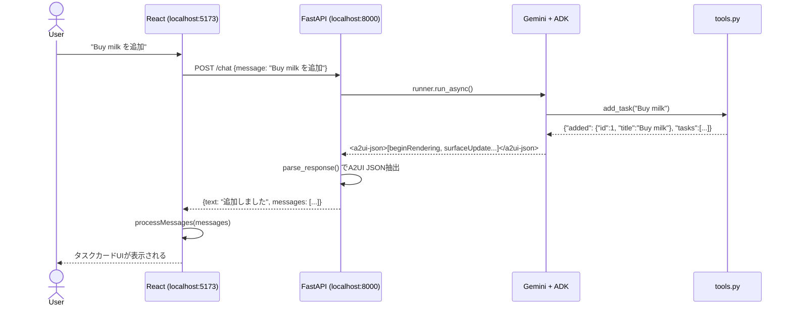

# A2UIとは何か？ — エージェントがUIを生成する仕組み

> このドキュメントは「エージェント開発が初めてのエンジニア」を対象に、A2UIの背景・目的・全体像を解説します。

---

## 目次

1. [なぜA2UIが必要なのか？](#1-なぜa2uiが必要なのか)
2. [A2UIの基本的な考え方](#2-a2uiの基本的な考え方)
3. [3つのレイヤー構成](#3-3つのレイヤー構成)
4. [このサンプルアプリで何が起きているか](#4-このサンプルアプリで何が起きているか)
5. [他のアプローチとの比較](#5-他のアプローチとの比較)

---

## 1. なぜA2UIが必要なのか？

### LLMは「テキスト」しか返せない問題

ChatGPTやGeminiなどのLLM（大規模言語モデル）は、自然言語のテキストを生成します。
しかし現代のWebアプリが必要とするのは、**インタラクティブなUI**です。

```
ユーザー: 「今日のToDoを見せて」

LLMの返答（従来）:
  "今日のタスクは以下の通りです：
   1. 買い物（未完了）
   2. 会議の準備（完了）"
```

これはただのテキストです。ボタンを押すことも、チェックボックスにチェックをつけることもできません。

### 「エージェント」になると何が変わるか？

LLMに**ツール（関数）**を与えると「エージェント」になります。エージェントは自ら判断してツールを呼び出し、その結果をもとに回答を生成します。

```
ユーザー: 「今日のToDoを見せて」
   ↓
エージェント: list_tasks() ツールを呼ぶ
   ↓
ツール: [{"id":1, "title":"買い物", "completed":false}, ...]
   ↓
エージェント: このデータをもとに返答を生成
```

でも結果はやはり「テキスト」。UIにはなりません。

### A2UIが解決する問題

**A2UI（Agent-to-UI）** は、エージェントの返答の中に「UIの設計図（JSON）」を埋め込む仕組みです。

```
エージェントの返答:
  "タスク一覧を表示します。

  <a2ui-json>
  [
    {"beginRendering": {"surfaceId": "tasks", "root": "root"}},
    {"surfaceUpdate": {
      "surfaceId": "tasks",
      "components": [
        {"id": "root", "component": {"Column": {...}}},
        {"id": "task-1", "component": {"Card": {...}}},
        {"id": "done-btn", "component": {"Button": {"action": {"name": "complete_task"}}}}
      ]
    }}
  ]
  </a2ui-json>"
```

フロントエンドはこの `<a2ui-json>` ブロックを取り出し、**実際のReactコンポーネントとしてレンダリング**します。

---

## 2. A2UIの基本的な考え方

### エージェントが「UI設計者」になる

A2UIの核心は、**UIのレイアウトと構造をエージェントが決める**という発想です。

```
従来のWebアプリ:
  エンジニアが事前にUIを設計 → フロントエンドにコーディング → LLMはデータだけ返す

A2UIのアプローチ:
  エージェントがUIの構造を動的に生成 → フロントエンドはそれを描画するだけ
```

これにより：
- **UIの変更がバックエンド変更だけで完結**する（フロントエンドのコードを変えなくていい）
- **文脈に応じたUI**が生成できる（タスクが0件のときは「空です」、あるときはカードリスト、など）
- **マルチモーダルなサーフェス**（画面の複数エリア）を管理できる

---

## 3. 3つのレイヤー構成

A2UIは3つのレイヤーで成り立っています。

```
┌──────────────────────────────────────────────────────────┐
│  Layer 1: Agent (Python)                                  │
│  ┌──────────────┐   ┌──────────────────────────────────┐ │
│  │  LlmAgent    │──▶│  A2UISchemaManager               │ │
│  │  (Gemini)    │   │  スキーマをシステムプロンプトに注入│ │
│  └──────────────┘   └──────────────────────────────────┘ │
│         │                                                  │
│         ▼                                                  │
│  ツール呼び出し → データ取得 → A2UI JSON生成 → <a2ui-json>│
└─────────────────────────────┬────────────────────────────┘
                               │  HTTP POST /chat
                               ▼
┌──────────────────────────────────────────────────────────┐
│  Layer 2: Protocol (JSON over HTTP)                       │
│                                                           │
│  {                                                        │
│    "text": "タスク一覧を表示します",                       │
│    "messages": [                                          │
│      {"beginRendering": {...}},                           │
│      {"surfaceUpdate": {"components": [...]}}             │
│    ]                                                      │
│  }                                                        │
└─────────────────────────────┬────────────────────────────┘
                               │
                               ▼
┌──────────────────────────────────────────────────────────┐
│  Layer 3: Renderer (React)                                │
│                                                           │
│  processMessages(data.messages)                           │
│  → A2UIRenderer surfaceId="tasks"                        │
│  → Column > Card > Row > Text, Button, Button            │
│                                                           │
│  ┌─────────────────────────────┐                         │
│  │  My Tasks                   │                         │
│  │  ┌─────────────────────┐    │                         │
│  │  │ 買い物   ✓Done Delete│    │                         │
│  │  └─────────────────────┘    │                         │
│  └─────────────────────────────┘                         │
└──────────────────────────────────────────────────────────┘
```

### 各レイヤーの役割まとめ

| レイヤー | 技術 | 役割 |
|---|---|---|
| **Agent** | Python, ADK, Gemini | UIの設計図（A2UI JSON）を生成する |
| **Protocol** | JSON, HTTP | エージェントとフロントエンドの共通言語 |
| **Renderer** | React, @a2ui/react | JSON設計図を実際のUIコンポーネントに変換 |

---

## 4. このサンプルアプリで何が起きているか

このリポジトリのTodoアプリは、A2UIの全レイヤーを実装したサンプルです。



---

## 5. 他のアプローチとの比較

A2UIを理解するために、他のアプローチと比べてみましょう。

### アプローチA: 従来のWebアプリ（エージェントなし）

```
フロントエンド → REST API → データベース
エンジニアがUIを事前設計 → 固定のUI
```

**問題**: UIが静的。動的に構造を変えるには大規模な実装が必要。

---

### アプローチB: LLMに「データだけ」返させる（よくある実装）

```python
# ツールがデータを返す
def list_tasks():
    return json.dumps(tasks)

# フロントエンドがデータをUIに変換する（React側）
{tasks.map(t => <TaskCard task={t} />)}
```

**問題**:
- UIの変更はフロントエンドエンジニアが行う必要がある
- エージェントの文脈（「緊急タスクは赤くして」など）をUIに反映しにくい
- コンポーネントの種類や構造が静的に決まってしまう

---

### アプローチC: A2UI（このサンプルの実装）

```python
# ツールはデータを返す（UIを知らない）
def list_tasks():
    return json.dumps(tasks)

# エージェント（LLM）がUIの構造を決めてA2UI JSONを生成
# フロントエンドはA2UIRendererで描画するだけ
```

**利点**:
- UIの構造はエージェントが動的に決める
- フロントエンドはレンダラーを置くだけ（UIロジック不要）
- 「タスクが多い場合はページネーションを使って」などをプロンプトで制御できる

---

## まとめ

| 概念 | 説明 |
|---|---|
| **A2UI** | エージェントがUIの設計図（JSON）を生成し、フロントエンドが描画するプロトコル |
| **サーフェス** | UIが描画される「名前付き領域」（例: "tasks"） |
| **A2UI JSON** | `beginRendering` + `surfaceUpdate` のメッセージ配列 |
| **`<a2ui-json>` タグ** | LLMの返答テキストの中でA2UI JSONを区切るタグ |
| **コンポーネント** | Column, Row, Card, Text, Button などのUI部品 |

次のドキュメント: [02-protocol.md — A2UIプロトコル詳解](./02-protocol.md)
