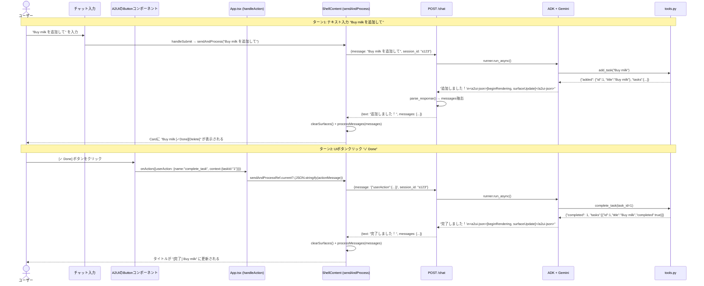

# アクションライフサイクル — ボタンクリックからUI更新まで

> ユーザーがUIのボタンをクリックしてから、画面が更新されるまでの全ステップを追います。
> 「どこで何が起きているか」を完全に理解するためのドキュメントです。

---

## 目次

1. [2つのリクエストパターン](#1-2つのリクエストパターン)
2. [パターンA: テキスト入力フロー](#2-パターンa-テキスト入力フロー)
3. [パターンB: UIボタンクリックフロー](#3-パターンb-uiボタンクリックフロー)
4. [シーケンス図（全体像）](#4-シーケンス図全体像)
5. [各ステップのコード対応](#5-各ステップのコード対応)
6. [デバッグのヒント](#6-デバッグのヒント)

---

## 1. 2つのリクエストパターン

このTodoアプリでエージェントへのリクエストは2つの経路があります。

```
パターンA: テキスト入力
  ユーザーがフォームに文字を入力して「送信」

パターンB: UIアクション
  ユーザーがA2UIのButtonコンポーネントをクリック
```

どちらも最終的には **`POST /chat`** にメッセージを送るという点で同じですが、
**メッセージの内容**が異なります。

| パターン | メッセージ内容 | 例 |
|---|---|---|
| A: テキスト入力 | 自然言語テキスト | `"Buy milk を追加して"` |
| B: UIアクション | JSON文字列化されたアクション | `'{"userAction":{"name":"complete_task","context":{"taskId":"1"}}}'` |

エージェント（LLM）はどちらのパターンも自然言語として受け取り、
文脈に応じてツールを呼び出します。

---

## 2. パターンA: テキスト入力フロー

```
┌──────────────────────────────────────────────────────────────────────┐
│ STEP 1: ユーザーがフォームに入力して送信                               │
│                                                                        │
│   <form onSubmit={handleSubmit}>                                       │
│     <input name="message" value="Buy milk を追加して" />               │
│     <button type="submit">送信</button>                                │
│   </form>                                                              │
└────────────────────────────────┬─────────────────────────────────────┘
                                  │ handleSubmit(e)
                                  ▼
┌──────────────────────────────────────────────────────────────────────┐
│ STEP 2: sendAndProcess("Buy milk を追加して") が呼ばれる               │
│                                                                        │
│   const body = "Buy milk を追加して"  // string のまま                 │
│   fetch('/chat', {                                                     │
│     body: JSON.stringify({                                             │
│       message: "Buy milk を追加して",                                  │
│       session_id: "session-1710000000000"                              │
│     })                                                                 │
│   })                                                                   │
└────────────────────────────────┬─────────────────────────────────────┘
                                  │ POST /chat
                                  ▼
┌──────────────────────────────────────────────────────────────────────┐
│ STEP 3: バックエンド (server.py) がエージェントを実行                  │
│                                                                        │
│   new_message = "Buy milk を追加して"                                   │
│   → runner.run_async() → LLMが add_task("Buy milk") を判断・実行      │
│   → final_response: "追加しました！\n<a2ui-json>[...]</a2ui-json>"    │
└────────────────────────────────┬─────────────────────────────────────┘
                                  │ ChatResponse
                                  ▼
┌──────────────────────────────────────────────────────────────────────┐
│ STEP 4: フロントエンドがレスポンスを処理                               │
│                                                                        │
│   data = { text: "追加しました！", messages: [{beginRendering}, ...] } │
│   clearSurfaces()        // 古いUIをクリア                             │
│   processMessages(data.messages) // 新しいUIを適用                    │
│   → A2UIRenderer が自動再描画                                          │
└──────────────────────────────────────────────────────────────────────┘
```

---

## 3. パターンB: UIボタンクリックフロー

```
┌──────────────────────────────────────────────────────────────────────┐
│ STEP 1: ユーザーが [✓ Done] ボタンをクリック                          │
│                                                                        │
│   A2UIRendererが描画したButtonコンポーネントをクリック                  │
│   ボタンにはこのactionが定義されている:                                  │
│   {                                                                    │
│     name: "complete_task",                                             │
│     context: [{"key": "taskId", "value": {"literalString": "1"}}]    │
│   }                                                                    │
└────────────────────────────────┬─────────────────────────────────────┘
                                  │ A2UIRendererが内部でonActionを呼ぶ
                                  ▼
┌──────────────────────────────────────────────────────────────────────┐
│ STEP 2: A2UIProvider の onAction が呼ばれる (App.tsx)                │
│                                                                        │
│   handleAction({                                                       │
│     userAction: {                                                      │
│       name: "complete_task",                                           │
│       context: { taskId: "1" }   // ← 配列→オブジェクトに変換済み      │
│     }                                                                  │
│   })                                                                   │
└────────────────────────────────┬─────────────────────────────────────┘
                                  │ sendAndProcessRef.current?(JSON.stringify(actionMessage))
                                  ▼
┌──────────────────────────────────────────────────────────────────────┐
│ STEP 3: sendAndProcess が JSON文字列でfetch (ShellContent)            │
│                                                                        │
│   const body = '{"userAction":{"name":"complete_task","context":{...}}}' │
│   fetch('/chat', {                                                     │
│     body: JSON.stringify({                                             │
│       message: '{"userAction":...}',  // JSON文字列がメッセージ         │
│       session_id: "session-..."                                        │
│     })                                                                 │
│   })                                                                   │
└────────────────────────────────┬─────────────────────────────────────┘
                                  │ POST /chat
                                  ▼
┌──────────────────────────────────────────────────────────────────────┐
│ STEP 4: バックエンドがエージェントを実行                               │
│                                                                        │
│   new_message = '{"userAction":{"name":"complete_task","context":{}}}'│
│   → LLMが受け取る（ユーザーのメッセージとして）                         │
│   → LLMが判断: "complete_task アクション、taskId=1"                   │
│   → complete_task(task_id=1) を呼ぶ                                   │
│   → final_response: "完了しました！\n<a2ui-json>[...]</a2ui-json>"   │
└────────────────────────────────┬─────────────────────────────────────┘
                                  │ 更新されたUIが返ってくる
                                  ▼
┌──────────────────────────────────────────────────────────────────────┐
│ STEP 5: フロントエンドがUIを更新                                       │
│                                                                        │
│   clearSurfaces() → processMessages(data.messages)                   │
│   → タスクタイトルが "[完了] Buy milk" に更新されたUIが再描画           │
└──────────────────────────────────────────────────────────────────────┘
```

---

## 4. シーケンス図（全体像）

「Buy milk を追加」→「✓ Done をクリック」の2ターンのシーケンス：



---

## 5. 各ステップのコード対応

### ステップ: onAction からの呼び出し

```tsx
// App.tsx
const handleAction = useCallback((actionMessage: Types.A2UIClientEventMessage) => {
  console.log('User action:', actionMessage);
  // actionMessage をJSON文字列化してエージェントへ送る
  sendAndProcessRef.current?.(JSON.stringify(actionMessage));
}, []);
```

> `sendAndProcessRef.current?.()` は **optional chaining** です。
> `sendAndProcessRef.current` が `null` でも安全に呼べます。

---

### ステップ: fetch してエージェントへ送信

```tsx
// ShellContent の sendAndProcess
const body = typeof message === 'string' ? message : JSON.stringify(message);
//            ↑ string（テキスト入力）か
//                                           ↑ A2UIClientEventMessage のJSONか

const res = await fetch('/chat', {
  method: 'POST',
  headers: { 'Content-Type': 'application/json' },
  body: JSON.stringify({
    message: body,           // LLMへの入力
    session_id: SESSION_ID,  // 会話の継続性
  }),
});
```

---

### ステップ: LLMがアクションJSONを受け取る

LLMが受け取るメッセージ:
```json
{
  "userAction": {
    "name": "complete_task",
    "context": { "taskId": "1" }
  }
}
```

LLMはこれを**ユーザーのメッセージとして読む**ことに注意してください。
システムプロンプトに書いた指示がここで機能します:

```
UIからアクション JSON（{"userAction": {"name": "...", "context": {...}}}）を受け取った場合は、
name と context.taskId を読み取って対応するツールを呼び出す（taskId は int に変換）
```

LLMはこの指示に従い、`complete_task(task_id=1)` を呼び出します。

---

### ステップ: バックエンドのA2UIパース

```python
# server.py
final_response_text = "完了しました！\n<a2ui-json>[...]</a2ui-json>"

if has_a2ui_parts(final_response_text):
    parts = parse_response(final_response_text)
    for part in parts:
        if part.a2ui_json:
            # part.a2ui_json = [{beginRendering:...}, {surfaceUpdate:...}]
            a2ui_messages.extend(part.a2ui_json)

    # テキストからA2UIタグを除去
    plain_text = re.sub(
        r"<a2ui-json>.*?</a2ui-json>", "", final_response_text, flags=re.DOTALL
    ).strip()
    # plain_text = "完了しました！"
```

---

### ステップ: フロントエンドのUI更新

```tsx
const data = await res.json();
// data = {
//   text: "完了しました！",
//   messages: [
//     {"beginRendering": {"surfaceId": "tasks", "root": "root"}},
//     {"surfaceUpdate": {"surfaceId": "tasks", "components": [
//       {"id": "task-1-title", "component": {"Text": {"text": {"literalString": "[完了] Buy milk"}}}}
//       ...
//     ]}}
//   ]
// }

setResponseText(data.text || '');  // "完了しました！"
clearSurfaces();                    // 古いUIを消す
processMessages(data.messages);     // 新しいUIを適用
// → A2UIRenderer が再描画: "[完了] Buy milk" に更新
```

---

## 6. デバッグのヒント

### ブラウザのコンソールで確認

```tsx
// App.tsx の handleAction に追加
const handleAction = useCallback((actionMessage) => {
  console.log('👆 User action:', actionMessage);
  // → 何のアクションがどんなcontextで来たか確認できる
  sendAndProcessRef.current?.(JSON.stringify(actionMessage));
}, []);
```

```tsx
// ShellContent の sendAndProcess に追加
const data = await res.json();
console.log('🤖 Agent response:', data);
// → text と messages の内容を確認できる
```

### バックエンドのログ確認

`server.py` の logger が有効になっています:

```python
# uvicorn起動時のログに表示される
logger.info("Final response: %s", final_response_text[:300])
```

ログを詳細にする場合:
```bash
uv run uvicorn app.server:app --reload --port 8000 --log-level debug
```

### A2UIが描画されない場合のチェックリスト

```
1. data.messages が空でないか確認
   → console.log('Agent response:', data) で確認

2. <a2ui-json> タグがLLMの返答に含まれているか確認
   → バックエンドの logger.info ログで確認

3. beginRendering の surfaceId と A2UIRenderer の surfaceId が一致しているか確認
   → "tasks" と "tasks" が一致しているか

4. parse_response() がエラーを投げていないか確認
   → バックエンドの WARNING ログを確認
   → logger.warning("Failed to parse A2UI response: %s", e)

5. clearSurfaces() を呼んでいるか確認
   → 古いUIが残っていて新しいUIが上書きできていないかも
```

### よくある問題と対処

| 症状 | 原因 | 対処 |
|---|---|---|
| UIが表示されない | LLMが`<a2ui-json>`を生成していない | UI_DESCRIPTIONを詳細にする |
| ボタンクリックが反応しない | `onAction`が呼ばれていない | `handleAction`にconsole.logを追加して確認 |
| 「タスク不明」エラー | `taskId`の型変換漏れ | agent.pyのUI_DESCRIPTIONに「taskIdはintに変換」を明記 |
| 古いタスクが残る | `clearSurfaces()`を呼んでいない | `processMessages`の前に必ず呼ぶ |
| APIキーエラー | `.env`が読まれていない | `GEMINI_API_KEY`が設定されているか確認 |

---

## まとめ: 全体のデータフロー

```
テキスト入力                  UIボタンクリック
    │                              │
    ▼                              ▼
handleSubmit()             handleAction(A2UIClientEventMessage)
    │                              │
    └──────────────┬───────────────┘
                   │ sendAndProcess(message)
                   ▼
            POST /chat
            {message, session_id}
                   │
                   ▼
         runner.run_async()
                   │
         ┌─────────┴──────────┐
         │                    │
    tool_call             final_response
    add_task()        "...<a2ui-json>...</a2ui-json>"
         │                    │
    tool_result          parse_response()
    {added: {...}}            │
         │             ┌──────┴───────┐
         └─────→ LLM   │              │
                       ▼              ▼
                   messages        plain_text
                   [{beginRendering}, {surfaceUpdate}]
                       │
                       ▼
            clearSurfaces() + processMessages(messages)
                       │
                       ▼
              A2UIRenderer 再描画
                       │
                       ▼
              ユーザーに更新されたUIが見える ✅
```

---

以上でA2UIのライフサイクルの全体像を理解できたはずです。
このパターンを応用すれば、TodoアプリのようなシンプルなものからERPのような複雑なUIまで、
エージェントが動的に生成するあらゆるインターフェースを構築できます。
